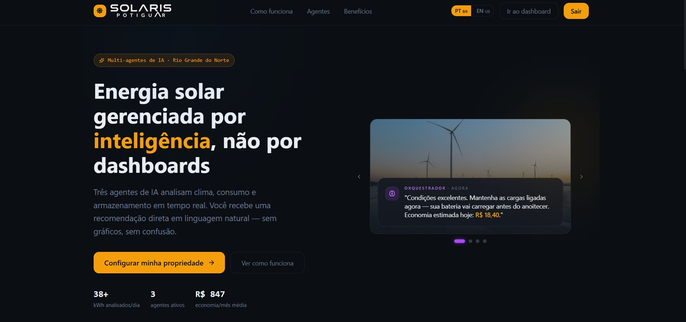
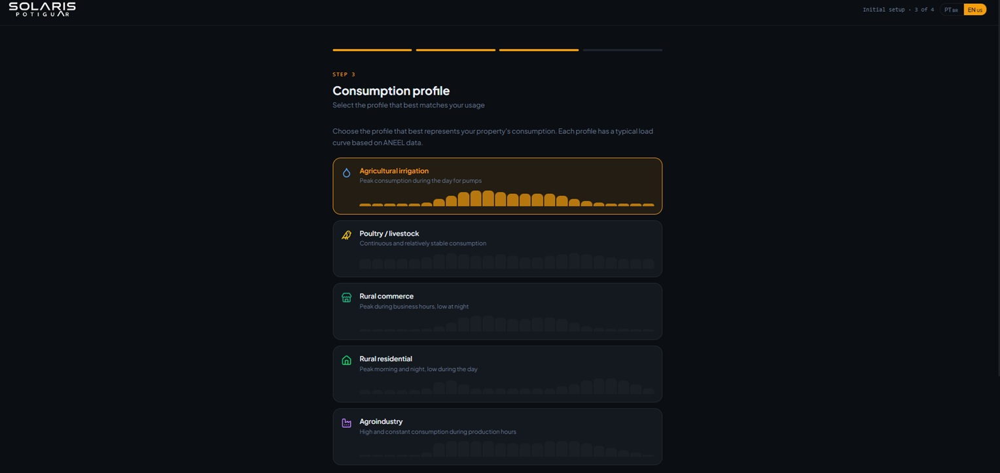
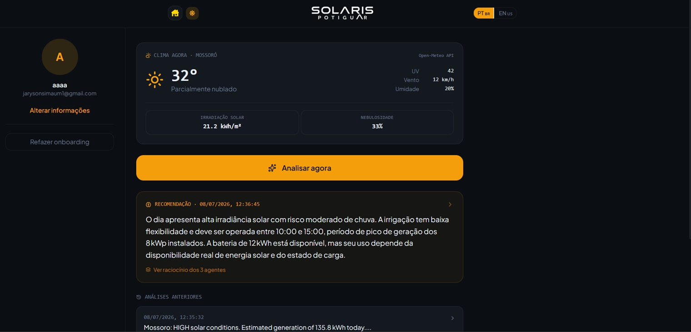
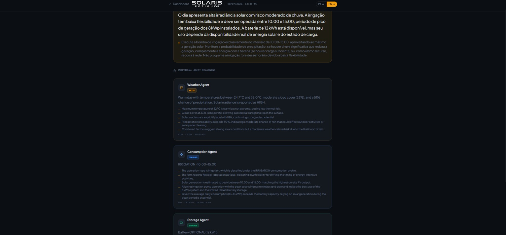

<div style= "margin: 20px;">   

</div>

<div style align="center">

[](https://www.amd.com)
[]()
[]()

</div>   

> **AI-powered decision support for small solar energy producers in Northeast Brazil.**

Solaris Potiguar is an AI-powered decision support platform that helps small rural producers, cooperatives, and agribusinesses maximize the value of their photovoltaic systems. By combining weather forecasts, operational context, and multi-agent reasoning accelerated by AMD infrastructure, Solaris turns complex energy data into simple, actionable recommendations.


# The Problem

Northeast Brazil has one of the highest solar irradiation levels in the world, making photovoltaic generation increasingly accessible to small rural producers and cooperatives.

However, owning solar panels does not automatically mean using energy efficiently.

Most small producers still decide **when to consume**, **when to shift activities**, and **how to use stored energy** based on experience rather than data. While large power plants rely on sophisticated Energy Management Systems (EMS), smaller operations rarely have access to affordable decision-support tools.

As a result, many producers miss opportunities to increase self-consumption, better utilize solar generation, and reduce electricity costs.

---

# Our Solution

Solaris Potiguar democratizes intelligent energy management.

Instead of presenting complex dashboards and technical metrics, Solaris provides clear operational recommendations based on each property's characteristics.

The platform combines:

- Weather forecasts
- Solar generation estimation
- Operational profile
- Consumption patterns
- Battery availability (when applicable)

These inputs are analyzed collaboratively by multiple AI agents, producing recommendations such as:

> **"High solar generation is expected tomorrow between 10 AM and 1 PM. If possible, schedule irrigation during this period to maximize self-consumption."**

The goal is not to replace existing Energy Management Systems, but to make intelligent decision support accessible to smaller producers.

---

# Multi-Agent Architecture

| Agent | Responsibility |
|--------|----------------|
| 🌤️ Weather Agent | Retrieves and interprets weather forecasts and solar irradiation data |
| ⚡ Consumption Agent | Analyzes operational profiles and consumption behavior |
| 🔋 Storage Agent | Evaluates battery availability and energy storage opportunities |
| 🧠 Orchestrator Agent | Combines all analyses into practical recommendations in natural language |
| 💬 Simplification Agent | Rewrites technical recommendations into extremely simple, accessible language |

---

# Technology Stack

## Frontend

| Technology | Version |
|---|---|
| React | 19 |
| TypeScript | 6.0.3|
| Vite | 8.1.1 |
| Tailwind CSS | 4 |
| React Router | ~7 |
| i18n | Portuguese / English |
| Docker | Multi-stage + Nginx |

---

## Backend

| Technology | Version |
|---|---|
| Ruby on Rails (API Only) | 7.2.3.1 |
| Ruby | 4.0.4 |
| PostgreSQL | 16 Alpine |
| Authentication | JWT (bcrypt + HS256) |
| Weather | Open-Meteo API |
| AI | Fireworks AI — 5 agents (gpt-oss-120b & gemma-7b-it) |
| Email | Action Mailer + SMTP |
| Docker | Multi-stage with entrypoint |

---

## Automation & Infrastructure

| Component | Description |
|---|---|
| Docker Compose | 4 services (db, backend, frontend, n8n) |
| n8n | Workflow engine for report automation |
| Scheduling | 05:00 UTC via n8n Schedule Trigger |
| Notification | Automatic daily email report |

---

#  Application Preview

### Landing Page



The landing page introduces Solaris Potiguar, its value proposition, and the multi-agent architecture.

---

### User Onboarding



The onboarding collects the property's operational profile, photovoltaic system information, and other data required for personalized analyses.

---

### Dashboard



The dashboard displays weather forecasts, estimated generation, recent analyses, and recommendations generated by the AI agents.

---

### Analysis Result



Each recommendation includes a detailed explanation of how the specialized agents contributed to the final decision.

---

# Product Flow

The platform follows a simple workflow designed for non-technical users.

```
User Setup
      ↓
Weather Forecast
      ↓
Solar Generation Estimation
      ↓
Multi-Agent Analysis
      ↓
Operational Recommendation
```

Instead of technical charts, users receive practical guidance that supports better daily decisions.

---

# Project Structure

```
Solaris-Potiguar/

├── FrontEnd/
│   ├── src/
│   │   ├── pages/          # Landing, Login, Register, Onboarding, Dashboard, Result
│   │   ├── components/     # HeroCarousel, ThemeToggle, LangSelector
│   │   ├── services/       # api.ts (all endpoints)
│   │   ├── types/          # TypeScript interfaces
│   │   ├── i18n/           # pt.ts, en.ts
│   │   └── routes/         # React Router configuration
│   ├── Dockerfile          # Multi-stage with Nginx
│   └── ...
│
├── BackEnd/
│   ├── app/
│   │   ├── controllers/    # API + Auth + Analysis + Daily
│   │   ├── models/         # User, Property, Analysis
│   │   ├── services/       # Climate, Energy, 5 AI Agents, JWT
│   │   ├── mailers/        # ApplicationMailer, DailyAnalysisMailer
│   │   ├── serializers/    # AnalysisSerializer
│   │   └── views/          # Mailer templates (HTML + TXT)
│   ├── config/
│   │   ├── routes.rb
│   │   ├── locales/        # pt-BR.yml, en.yml
│   │   └── environments/   # development, production, test
│   ├── db/
│   │   ├── schema.rb       # users, properties, analyses
│   │   └── migrate/
│   ├── Dockerfile          # Multi-stage Ruby + Rails
│   └── ...
│
├── n8n/
│   ├── workflows/          # daily_analysis_workflow.json
│   ├── import-workflow.sh
│   └── import-workflow.ps1
│
├── .docs/
│   ├── useCase.md
│   ├── RegrasdNegocio.md
│   ├── api.md
│   ├── archteture.md
│   ├── Pitch.md
│   └── Sequence-flow-Diagram/
│
├── docker-compose.yml      # 4 services: db, backend, frontend, n8n
├── .env.example
├── README.md
└── LICENSE
```

---

# Roadmap

## Frontend MVP ✅

- [x] Landing Page
- [x] Authentication UI
- [x] Multi-step onboarding
- [x] Dashboard
- [x] Analysis Result Page
- [x] Dark / Light Theme
- [x] Internationalization (PT / EN)

---

## Backend MVP ✅

- [x] Database Modeling
- [x] Domain Models
- [x] REST API
- [x] JWT Authentication
- [x] Open-Meteo Integration
- [x] Fireworks AI Integration
- [x] Frontend Integration

---

## Implemented

- [x] **Automatic daily email report** — n8n schedules at 05:00 UTC, Rails generates analyses and sends them via SMTP
- [x] **Docker automation** — n8n as a service in docker-compose, workflow pre-configured

---


# Market Opportunity

| Market | Description |
|---------|-------------|
| **TAM** | Brazilian distributed photovoltaic generation market |
| **SAM** | Rural producers and small businesses using photovoltaic systems |
| **SOM** | Small producers and cooperatives across Northeast Brazil |

---

# Business Model

### B2B SaaS

Monthly subscriptions for:

- Agricultural cooperatives
- Rural producers
- Small agribusinesses

### White Label

Platform licensing for:

- Local solar integrators
- Energy consulting companies

---

# Why AMD?

Solaris Potiguar runs its entire AI pipeline on Fireworks AI, leveraging AMD infrastructure to deliver fast and cost-effective large model inference.
Each analysis request triggers four specialized AI agents — Weather, Consumption, Storage, and Orchestrator — powered by fireworks/models/gpt-oss-120b, a 120-billion parameter open-source model. The orchestrator consolidates all analyses into a structured energy recommendation. A fifth agent, powered by Gemma, then rewrites that recommendation into plain, accessible language — ensuring that rural producers with no technical background can immediately understand and act on the insight.
The full pipeline completes in approximately 20 seconds, transforming raw climate and operational data into a property-specific recommendation ready for the field.
Running a 120B parameter model alongside Gemma through AMD-accelerated infrastructure makes it economically viable to serve small rural producers — a segment that cannot afford enterprise-grade energy software. The combination of AMD compute efficiency and the Fireworks AI API allows Solaris to keep inference costs low enough to support a SaaS model accessible to cooperatives and small agribusinesses across Northeast Brazil.

---

# Elevator Pitch

> Every day, thousands of small rural producers across Northeast Brazil make critical energy decisions manually — when to irrigate, when to run equipment, when to rely on the grid — based on experience alone, not data. In one of the world's highest solar irradiation regions, where photovoltaic systems are rapidly expanding, most small producers still can't access the intelligent tools that large power plants take for granted. Solaris Potiguar changes that. By combining real-time weather forecasts, operational context, and a multi-agent AI pipeline accelerated by AMD infrastructure, Solaris delivers what used to require enterprise software — in plain language, for the producer working in the field. Not another dashboard. Not another technical report. Just a clear answer to the question every producer asks every morning: what's the smartest thing I can do with my energy today?

---

# How to Run with Docker

## Prerequisites

- [Docker](https://docs.docker.com/get-docker/) and [Docker Compose](https://docs.docker.com/compose/install/) installed
- The [BackEnd/config/master.key](BackEnd/config/master.key) file present (Rails master key)

## Environment Variables

Copy the example file and fill in the variables:

```bash
cp .env.example .env
```

Expected content of `.env`:

```env
# ─── Required ─────────────────────────────────────
RAILS_MASTER_KEY=<content of config/master.key>
FIREWORKS_API_KEY=<your Fireworks AI key>

# ─── API key for daily automation (n8n → Rails) ──
# Generate with: openssl rand -hex 32
DAILY_ANALYSIS_API_KEY=<your secret key>

# ─── SMTP for sending emails ─────────────────────
SMTP_ADDRESS=smtp.gmail.com
SMTP_PORT=587
SMTP_USERNAME=<your email>
SMTP_PASSWORD=<your app password>
SMTP_AUTHENTICATION=plain
SMTP_ENABLE_STARTTLS=true
N8N_SMTP_SENDER=noreply@solarispotiguar.com

# ─── Optional ─────────────────────────────────────
N8N_HOST=localhost
N8N_PROTOCOL=http
```

## Starting the Services

```bash
# Build and start all services
docker compose up --build

# Run in the background (detached)
docker compose up --build -d

# Stop the services
docker compose down

# Stop and remove volumes (database data)
docker compose down -v
```

## Accessing the Application

| Service | URL |
|----------|------------------------------|
| Frontend | http://localhost |
| Backend | http://localhost:3000 |
| n8n | http://localhost:5678 |
| Database | http://localhost:5432 (postgres/postgres) |

The Nginx instance in the frontend container automatically proxies calls to `/api/`, `/solaris_potiguar/`, and `/up` to the backend.

## Import the Workflow into n8n

After starting the containers, import the daily report workflow:

**Windows (PowerShell):**
```powershell
.\n8n\import-workflow.ps1
```

**Linux / macOS:**
```bash
chmod +x n8n/import-workflow.sh
./n8n/import-workflow.sh
```

**Or manually:**
1. Go to http://localhost:5678
2. Open **Workflows** > **Import from File**
3. Select `n8n/workflows/daily_analysis_workflow.json`
4. Activate the workflow (the **Active** button)

> The workflow runs automatically every day at **05:00 UTC** (about **02:00 BRT**).

## Automation Flow

```
⏰ n8n Schedule Trigger (05:00 UTC)
        │
        ▼
📡 POST /api/daily/send_reports  (with X-API-Key)
        │
        ▼
⚙️ Rails iterates through all users/properties
        │
        ├── 🌤️ ClimateService (Open-Meteo)
        ├── ⚡ EnergyCalculatorService
        ├── 🤖 WeatherAgent / ConsumptionAgent / StorageAgent
        ├── 🧠 OrchestratorAgent
        ├── 💬 SimplificationAgent
        └── 💾 Saves the analysis to the database
        │
        ▼
📧 DailyAnalysisMailer sends an email to each user
        │
        ▼
✅ Summary returned to n8n
```

## Useful Commands

```bash
# View logs for a specific service
docker compose logs -f backend
docker compose logs -f frontend
docker compose logs -f n8n
docker compose logs -f db

# Run commands in the backend
docker compose exec backend rails db:migrate
docker compose exec backend rails db:seed
docker compose exec backend rails console

# Run commands in the frontend
docker compose exec frontend sh

# Rebuild a specific service
docker compose build backend
docker compose build frontend

# Check n8n workflow execution
docker compose exec n8n n8n list:workflows
```

---
## Team

**Jaryson Gomes** — Solo Founder and Developer
[LinkedIn](https://linkedin.com/in/jaryson-gomes) ·
Mossoró, Rio Grande do Norte, Brazil

## Developed for the **AMD Hackathon 2026 – Unicorn Track**.
